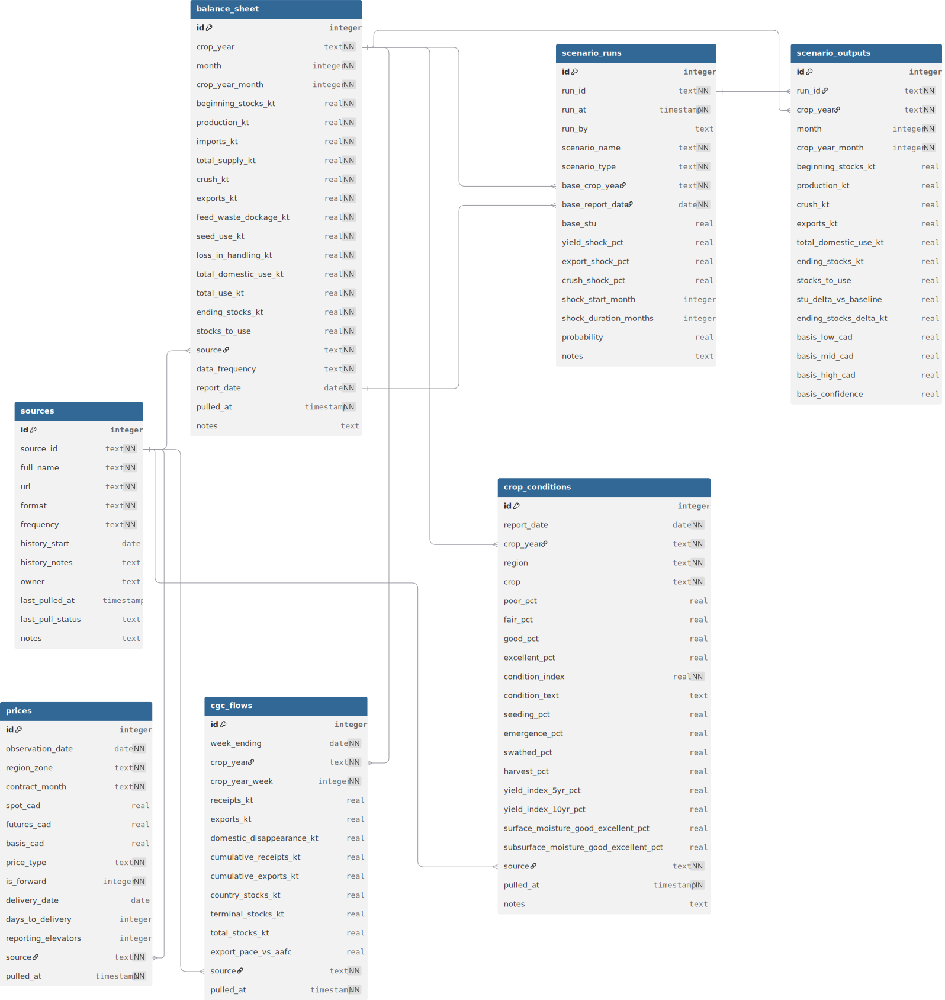

# Project Reference Documentation

# Database Schema Reference

## Tables

1. [`balance_sheet`](#1-balance_sheet) — monthly S&D estimates by vintage
2. [`prices`](#2-prices) — daily spot and forward cash bids + futures
3. [`crop_conditions`](#3-crop_conditions) — weekly in-season crop condition ratings
4. [`cgc_flows`](#4-cgc_flows) — weekly grain movement and elevator stocks
5. [`scenario_runs`](#5-scenario_runs) — scenario metadata and assumptions log
6. [`scenario_outputs`](#6-scenario_outputs) — implied balance sheet and basis per scenario
7. [`sources`](#7-sources) — source registry and ingestion config

---

## 1. `balance_sheet`

Monthly Western Canada canola balance sheet. Each row is one month's estimate
from one report vintage. Both AAFC (monthly) and StatsCan (3x/year) write into
this table — `source` and `data_frequency` distinguish them.

AAFC revises prior months with each new release. Every vintage is stored as a
separate row and is never overwritten.

```sql
CREATE TABLE balance_sheet (
    -- Identity
    id                      INTEGER PRIMARY KEY AUTOINCREMENT,
    crop_year               TEXT        NOT NULL,   -- e.g. "2024/25" (Aug–Jul)
    month                   INTEGER     NOT NULL,   -- calendar month 1–12
    crop_year_month         INTEGER     NOT NULL,   -- position in crop year: 1=Aug, 2=Sep ... 12=Jul

    -- Supply
    beginning_stocks_kt     REAL        NOT NULL,
    production_kt           REAL        NOT NULL,
    imports_kt              REAL        NOT NULL DEFAULT 0,
    total_supply_kt         REAL        NOT NULL,   -- beginning + production + imports (stored explicitly)

    -- Demand — matches AAFC breakdown exactly
    crush_kt                REAL        NOT NULL,   -- food and industrial use, primarily crush
    exports_kt              REAL        NOT NULL,
    feed_waste_dockage_kt   REAL        NOT NULL DEFAULT 0,   -- feed, waste and dockage combined
    seed_use_kt             REAL        NOT NULL DEFAULT 0,
    loss_in_handling_kt     REAL        NOT NULL DEFAULT 0,

    -- Derived totals (calculated and stored explicitly — do not recalculate on the fly)
    total_domestic_use_kt   REAL        NOT NULL,   -- crush + feed_waste_dockage + seed_use + loss_in_handling
    total_use_kt            REAL        NOT NULL,   -- total_domestic_use + exports
    ending_stocks_kt        REAL        NOT NULL,   -- total_supply - total_use
    stocks_to_use           REAL        NOT NULL,   -- ending_stocks / total_use

    -- Source metadata
    source                  TEXT        NOT NULL,   -- "AAFC" | "StatsCan_32-10-0013-01" | "StatsCan_32-10-0359-01"
    data_frequency          TEXT        NOT NULL,   -- "monthly" | "triannual" | "annual"
    report_date             DATE        NOT NULL,   -- vintage: date source published this estimate
    pulled_at               TIMESTAMP   NOT NULL DEFAULT CURRENT_TIMESTAMP,
    notes                   TEXT,

    UNIQUE (crop_year, month, source, report_date)
);

CREATE INDEX idx_bs_crop_year        ON balance_sheet (crop_year);
CREATE INDEX idx_bs_report_date      ON balance_sheet (report_date);
CREATE INDEX idx_bs_stu              ON balance_sheet (stocks_to_use);
CREATE INDEX idx_bs_source           ON balance_sheet (source);
CREATE INDEX idx_bs_crop_year_month  ON balance_sheet (crop_year, crop_year_month);
```

### Notes
- `crop_year_month` runs 1–12 where 1 = August, 12 = July. Always use this for
  seasonal cross-year joins — never use raw `month` for crop-year-relative analysis.
- Balance sheet identity must hold exactly:
  `ending = beginning + production + imports - crush - exports - feed_waste_dockage - seed_use - loss_in_handling`
  Validate with the identity check query at the bottom of this document after every insert.
- StatsCan table `32-10-0013-01` publishes full S&D at March 31, July 31, Dec 31.
  Use this as the authoritative historical anchor. AAFC fills in monthly estimates
  between those points.
- `feed_waste_dockage_kt` is named to match AAFC's exact terminology. Do not rename
  or split unless AAFC changes its reporting structure.
- Never `UPDATE` or `DELETE` rows. New AAFC vintage = new row with new `report_date`.
  The latest `report_date` for a given `(crop_year, month, source)` is the current
  best estimate.

---

## 2. `prices`

Daily spot and forward cash bids for Southern Alberta delivery zones plus ICE
canola futures. Spot and forward bids coexist in the same table, distinguished
by `price_type` and `is_forward`.

**PDQ note:** Prices are regional zone averages aggregated from multiple grain
company bids — not individual elevator prices. History begins September 2015.
Pre-2015 basis data is not available from this source.

```sql
CREATE TABLE prices (
    -- Identity
    id                      INTEGER PRIMARY KEY AUTOINCREMENT,
    observation_date        DATE        NOT NULL,
    region_zone             TEXT        NOT NULL,   -- PDQ zone e.g. "Southern AB", "Central AB"
                                                    -- or "ICE_Futures" for futures-only rows
    contract_month          TEXT        NOT NULL,   -- e.g. "2025-11"

    -- Price fields (CAD/tonne throughout)
    spot_cad                REAL,                   -- regional average spot bid (NULL for futures rows)
    futures_cad             REAL,                   -- ICE nearby or matched contract price
    basis_cad               REAL,                   -- spot_cad - futures_cad (stored at observation time)

    -- Price classification
    price_type              TEXT        NOT NULL,   -- "spot" | "forward" | "futures"
    is_forward              INTEGER     NOT NULL DEFAULT 0,
    delivery_date           DATE,                   -- first delivery date of contract (NULL if spot)
    days_to_delivery        INTEGER,                -- observation_date to delivery_date

    -- Data quality context
    reporting_elevators     INTEGER,                -- number of elevators reporting in zone
                                                    -- low count = less reliable average

    -- Provenance
    source                  TEXT        NOT NULL,   -- "PDQ" | "ICE_YahooFinance"
    pulled_at               TIMESTAMP   NOT NULL DEFAULT CURRENT_TIMESTAMP,

    UNIQUE (observation_date, region_zone, contract_month, price_type, source)
);

CREATE INDEX idx_prices_obs_date   ON prices (observation_date);
CREATE INDEX idx_prices_zone       ON prices (region_zone);
CREATE INDEX idx_prices_contract   ON prices (contract_month);
CREATE INDEX idx_prices_type       ON prices (price_type);
CREATE INDEX idx_prices_is_forward ON prices (is_forward);
```

### Notes
- `basis_cad` is stored at insert time as `spot_cad - futures_cad`. Never
  recalculate downstream — the futures price at time of observation is what matters.
- For ICE futures rows: `region_zone = "ICE_Futures"`, `spot_cad = NULL`,
  `price_type = "futures"`.
- `days_to_delivery` enables time-decay analysis — a Nov contract bid in August
  (90 days out) is materially different from the same bid in October (30 days out).
- `reporting_elevators` should be captured if PDQ exposes it. A zone average from
  2 elevators is much less reliable than one from 8.
- Contract roll: insert rows for both the expiring and new contract on the roll date.
- **History note:** PDQ launched September 2015. Basis analysis before that date
  must acknowledge this gap. Do not extrapolate.

---

## 3. `crop_conditions`

Weekly in-season crop condition ratings from Alberta crop reports. One row per
report per region per crop. Off-season rows are not inserted.

```sql
CREATE TABLE crop_conditions (
    -- Identity
    id                      INTEGER PRIMARY KEY AUTOINCREMENT,
    report_date             DATE        NOT NULL,
    crop_year               TEXT        NOT NULL,
    region                  TEXT        NOT NULL,   -- "South" | "Central" | "North East"
                                                    -- | "North West" | "Peace" | "Provincial"
    crop                    TEXT        NOT NULL DEFAULT 'canola',

    -- Raw condition breakdown (always store — do not discard raw percentages)
    poor_pct                REAL,
    fair_pct                REAL,
    good_pct                REAL,
    excellent_pct           REAL,

    -- Derived condition index
    condition_index         REAL        NOT NULL,   -- (poor*1 + fair*2 + good*3 + excellent*4) / 100
                                                    -- range 1.0–4.0
    condition_text          TEXT,                   -- "Poor"|"Fair"|"Good"|"Excellent" if only text available

    -- Progress fields (NULL off-season)
    seeding_pct             REAL,
    emergence_pct           REAL,
    swathed_pct             REAL,                   -- canola-specific pre-harvest stage
    harvest_pct             REAL,

    -- Yield index vs historical (Alberta crop report provides these directly each week)
    yield_index_5yr_pct     REAL,                   -- actual yield as % of 5-year average
                                                    -- e.g. 102.8 = 2.8% above 5-year avg
    yield_index_10yr_pct    REAL,

    -- Soil moisture
    surface_moisture_good_excellent_pct     REAL,
    subsurface_moisture_good_excellent_pct  REAL,

    -- Provenance
    source                  TEXT        NOT NULL DEFAULT 'AB_Crop_Report',
    pulled_at               TIMESTAMP   NOT NULL DEFAULT CURRENT_TIMESTAMP,
    notes                   TEXT,

    UNIQUE (report_date, region, crop)
);

CREATE INDEX idx_cc_report_date    ON crop_conditions (report_date);
CREATE INDEX idx_cc_crop_year      ON crop_conditions (crop_year);
CREATE INDEX idx_cc_region         ON crop_conditions (region);
CREATE INDEX idx_cc_condition_idx  ON crop_conditions (condition_index);
```

### Notes
- `condition_index` formula: `(poor_pct*1 + fair_pct*2 + good_pct*3 + excellent_pct*4) / 100`
  Always calculate from raw percentages when available. A spike in `poor_pct`
  matters more to the model than a small shift in `good_pct` — the raw breakdown
  captures this; a single summary text does not.
- `yield_index_5yr_pct` is the most directly useful column for the Phase 3 basis
  model. Alberta publishes it by region each week and it directly quantifies how
  the current season compares to the historical average.
- `swathed_pct` is canola-specific. Timing of swathing relative to average is both
  a quality and yield signal. Keep separate from `harvest_pct`.
- Region names match the Alberta crop report exactly: South, Central, North East,
  North West, Peace. Store a "Provincial" row from the provincial summary when
  the report provides one.
- AB crop reports are PDFs. Phase 2: manual entry for current season.
  Phase 3: build parser. Format consistency degrades pre-2015.

---

## 4. `cgc_flows`

Weekly grain movement data from the Canadian Grain Commission. Machine-readable
Excel files, published weekly. 100+ year archive. Cleanest source in the stack.

```sql
CREATE TABLE cgc_flows (
    -- Identity
    id                      INTEGER PRIMARY KEY AUTOINCREMENT,
    week_ending             DATE        NOT NULL,   -- Saturday
    crop_year               TEXT        NOT NULL,
    crop_year_week          INTEGER     NOT NULL,   -- 1 = first week of August

    -- Weekly flows (kt)
    receipts_kt             REAL,                   -- country elevator receipts from farms
    exports_kt              REAL,                   -- export inspections at terminal
    domestic_disappearance_kt REAL,

    -- Cumulative crop-year-to-date (CGC provides — store directly, do not derive)
    cumulative_receipts_kt  REAL,
    cumulative_exports_kt   REAL,

    -- Stocks (CGC reports country and terminal separately)
    country_stocks_kt       REAL,
    terminal_stocks_kt      REAL,
    total_stocks_kt         REAL,                   -- country + terminal (derived, stored explicitly)

    -- Pace signal (derived at insert time using current AAFC export forecast)
    export_pace_vs_aafc     REAL,                   -- cumulative_exports / AAFC full-year forecast
                                                    -- recalculate when AAFC revises forecast

    -- Provenance
    source                  TEXT        NOT NULL DEFAULT 'CGC',
    pulled_at               TIMESTAMP   NOT NULL DEFAULT CURRENT_TIMESTAMP,

    UNIQUE (week_ending, crop_year)
);

CREATE INDEX idx_cgc_week_ending ON cgc_flows (week_ending);
CREATE INDEX idx_cgc_crop_year   ON cgc_flows (crop_year);
CREATE INDEX idx_cgc_pace        ON cgc_flows (export_pace_vs_aafc);
CREATE INDEX idx_cgc_cy_week     ON cgc_flows (crop_year, crop_year_week);
```

### Notes
- `export_pace_vs_aafc` is the most useful derived column in the model. When pace
  is running below ~45% by mid-crop-year, that is a logistics or demand stress signal.
  Recalculate for all prior weeks in the crop year whenever AAFC revises its forecast.
- CGC Excel column positions have shifted between crop years — verify during Phase 1
  data source audit before writing the ingestion script.
- Prioritise getting the CGC pipeline running first in Phase 2 — it is the easiest
  source to ingest and provides immediate value.

---

## 5. `scenario_runs`

One row per scenario execution. Never delete rows — this is an audit trail.

```sql
CREATE TABLE scenario_runs (
    id                      INTEGER PRIMARY KEY AUTOINCREMENT,
    run_id                  TEXT        NOT NULL UNIQUE,  -- e.g. "2025-11-03-yield-shock-severe"
    run_at                  TIMESTAMP   NOT NULL DEFAULT CURRENT_TIMESTAMP,
    run_by                  TEXT,

    scenario_name           TEXT        NOT NULL,
    scenario_type           TEXT        NOT NULL,   -- "baseline"|"yield_shock"|"export_shock"
                                                    -- |"logistics"|"custom"
    base_crop_year          TEXT        NOT NULL,
    base_report_date        DATE        NOT NULL,
    base_stu                REAL,                   -- stocks-to-use at time of run (for context)

    -- Shock assumptions (NULL if not applicable)
    yield_shock_pct         REAL,
    export_shock_pct        REAL,
    crush_shock_pct         REAL,
    shock_start_month       INTEGER,
    shock_duration_months   INTEGER,

    probability             REAL,                   -- 0.0–1.0, sum across scenario set = 1.0
    notes                   TEXT
);

CREATE INDEX idx_sr_run_at        ON scenario_runs (run_at);
CREATE INDEX idx_sr_crop_year     ON scenario_runs (base_crop_year);
CREATE INDEX idx_sr_scenario_type ON scenario_runs (scenario_type);
```

---

## 6. `scenario_outputs`

Monthly balance sheet and implied basis range per scenario. One row per month
per scenario.

```sql
CREATE TABLE scenario_outputs (
    id                      INTEGER PRIMARY KEY AUTOINCREMENT,
    run_id                  TEXT        NOT NULL REFERENCES scenario_runs(run_id),
    crop_year               TEXT        NOT NULL,
    month                   INTEGER     NOT NULL,
    crop_year_month         INTEGER     NOT NULL,

    -- Scenario balance sheet
    beginning_stocks_kt     REAL,
    production_kt           REAL,
    crush_kt                REAL,
    exports_kt              REAL,
    total_domestic_use_kt   REAL,
    ending_stocks_kt        REAL,
    stocks_to_use           REAL,

    -- Delta vs baseline (for dashboard "what changed" view)
    stu_delta_vs_baseline   REAL,
    ending_stocks_delta_kt  REAL,

    -- Implied basis
    basis_low_cad           REAL,
    basis_mid_cad           REAL,
    basis_high_cad          REAL,
    basis_confidence        REAL,                   -- 0.0–1.0

    UNIQUE (run_id, crop_year, month)
);

CREATE INDEX idx_so_run_id    ON scenario_outputs (run_id);
CREATE INDEX idx_so_crop_year ON scenario_outputs (crop_year);
CREATE INDEX idx_so_stu       ON scenario_outputs (stocks_to_use);
```

---

## 7. `sources`

Source registry. One row per data source. Used by ingestion scripts for
scheduling and health monitoring. Separates config from code.

```sql
CREATE TABLE sources (
    id                      INTEGER PRIMARY KEY AUTOINCREMENT,
    source_id               TEXT        NOT NULL UNIQUE,
    full_name               TEXT        NOT NULL,
    url                     TEXT        NOT NULL,
    format                  TEXT        NOT NULL,   -- "xlsx"|"csv"|"pdf"|"web_scrape"|"api"
    frequency               TEXT        NOT NULL,   -- "daily"|"weekly"|"monthly"|"triannual"|"annual"
    history_start           DATE,
    history_notes           TEXT,
    owner                   TEXT,
    last_pulled_at          TIMESTAMP,
    last_pull_status        TEXT,                   -- "ok"|"failed"|"format_changed"
    notes                   TEXT
);

INSERT INTO sources (source_id, full_name, url, format, frequency, history_start, history_notes) VALUES

('StatsCan_32-10-0359-01',
 'Statistics Canada — Field crop areas, yield, production',
 'https://www150.statcan.gc.ca/t1/tbl1/en/tv.action?pid=3210035901',
 'csv', 'annual', '1986-01-01',
 'Annual production and yield only. No monthly breakdown. No crush or export data.'),

('StatsCan_32-10-0013-01',
 'Statistics Canada — Supply and disposition of grains in Canada',
 'https://www150.statcan.gc.ca/t1/tbl1/en/tv.action?pid=3210001301',
 'csv', 'triannual', '1996-01-01',
 'Full S&D balance sheet at March 31, July 31, Dec 31. Authoritative historical anchor.'),

('AAFC',
 'Agriculture and Agri-Food Canada — Outlook for Principal Field Crops',
 'https://agriculture.canada.ca/en/sector/crops/reports-statistics',
 'pdf', 'monthly', '2015-01-01',
 'Monthly balance sheet. Historical vintages not on public website — email aafc.bulletin.aac@agr.gc.ca for spreadsheet archive. PDFs archived by third parties back to ~2015.'),

('CGC',
 'Canadian Grain Commission — Grain Statistics Weekly',
 'https://www.grainscanada.gc.ca/en/grain-research/statistics/grain-statistics-weekly/',
 'xlsx', 'weekly', '1923-01-01',
 'Cleanest source. Excel files weekly, cumulative CSV each crop year. 100+ year archive. Canola broken out separately — verify column positions each crop year as they shift.'),

('AB_Crop_Report',
 'Government of Alberta — Alberta Crop Reports',
 'https://www.alberta.ca/alberta-crop-reports',
 'pdf', 'weekly', '2019-01-01',
 'In-season only (approx May–Oct). PDF format. Archives on Alberta.ca from 2019, program running since 1940. Format consistency degrades pre-2015.'),

('PDQ',
 'PDQ Alberta Grains — Spot and Forward Cash Bids',
 'https://www.pdqinfo.ca/',
 'web_scrape', 'daily', '2015-09-08',
 'Regional zone averages — not individual elevator prices. Nine zones across Western Canada. Southern AB zone covers Lethbridge area. History begins September 2015. No public API — web scrape required. Forward curves available.'),

('ICE_YahooFinance',
 'ICE Canola Futures via Yahoo Finance',
 'https://finance.yahoo.com/quote/RS=F/',
 'api', 'daily', '2000-01-01',
 'Ticker RS=F via yfinance. Daily OHLCV. Handle monthly contract rolls. Decide at Phase 1 whether to track nearby only or build continuous back-adjusted series.');
```

---

## Entity relationships

```
balance_sheet ─────────────────────────── (crop_year, month)
      │                                            │
      │ crop_year                                  │ crop_year
      │                                            │
cgc_flows ─── export_pace_vs_aafc references balance_sheet.exports_kt
                                                   │
crop_conditions ──────────────────── (crop_year, report_date, region)

prices ─── standalone, joined to balance_sheet by date range

scenario_runs ─── (base_crop_year, base_report_date) ── balance_sheet
      │
scenario_outputs ─── (run_id) ── scenario_runs
```

---

## Key queries

**Latest AAFC balance sheet for a crop year**
```sql
SELECT bs.*
FROM balance_sheet bs
INNER JOIN (
    SELECT crop_year, month, MAX(report_date) AS latest_report
    FROM balance_sheet
    WHERE crop_year = '2024/25' AND source = 'AAFC'
    GROUP BY crop_year, month
) latest
  ON bs.crop_year = latest.crop_year
 AND bs.month = latest.month
 AND bs.report_date = latest.latest_report
ORDER BY bs.crop_year_month;
```

**Stocks-to-use at same crop year position across multiple years**
```sql
SELECT crop_year, stocks_to_use, ending_stocks_kt, report_date
FROM balance_sheet
WHERE crop_year_month = 4
  AND source = 'AAFC'
  AND report_date = (
      SELECT MAX(report_date) FROM balance_sheet b2
      WHERE b2.crop_year = balance_sheet.crop_year
        AND b2.crop_year_month = 4
        AND b2.source = 'AAFC'
  )
ORDER BY crop_year;
```

**Spot basis series for Southern AB**
```sql
SELECT observation_date, basis_cad, futures_cad, spot_cad
FROM prices
WHERE region_zone = 'Southern AB'
  AND price_type = 'spot'
ORDER BY observation_date;
```

**Export pace vs same week in prior years**
```sql
SELECT crop_year, crop_year_week, export_pace_vs_aafc, cumulative_exports_kt
FROM cgc_flows
WHERE crop_year_week = 12
ORDER BY crop_year;
```

**In-season canola condition trend for South region**
```sql
SELECT report_date, condition_index, yield_index_5yr_pct,
       seeding_pct, swathed_pct, harvest_pct
FROM crop_conditions
WHERE region = 'South' AND crop = 'canola'
ORDER BY report_date;
```

**Scenario comparison — basis range across runs**
```sql
SELECT sr.scenario_name, sr.probability,
       so.crop_year_month, so.stocks_to_use,
       so.stu_delta_vs_baseline,
       so.basis_low_cad, so.basis_mid_cad, so.basis_high_cad
FROM scenario_outputs so
JOIN scenario_runs sr ON so.run_id = sr.run_id
WHERE so.crop_year = '2024/25'
ORDER BY sr.scenario_name, so.crop_year_month;
```

**Source health check**
```sql
SELECT source_id, frequency, last_pulled_at, last_pull_status,
       CAST(JULIANDAY('now') - JULIANDAY(last_pulled_at) AS INTEGER) AS days_since_pull
FROM sources
ORDER BY days_since_pull DESC;
```

---

## Balance sheet identity validation

Run after every ingestion batch. Any row with `identity_error` above 0.01
indicates a data or calculation error.

```sql
SELECT id, crop_year, month, source, report_date,
    ABS(
        (beginning_stocks_kt + production_kt + imports_kt)
        - (crush_kt + exports_kt + feed_waste_dockage_kt
           + seed_use_kt + loss_in_handling_kt + ending_stocks_kt)
    ) AS identity_error
FROM balance_sheet
WHERE ABS(
    (beginning_stocks_kt + production_kt + imports_kt)
    - (crush_kt + exports_kt + feed_waste_dockage_kt
       + seed_use_kt + loss_in_handling_kt + ending_stocks_kt)
) > 0.01
ORDER BY identity_error DESC;
```

---

## Known data gaps and mitigations

| Gap | Impact | Mitigation |
|---|---|---|
| AAFC historical vintages not on public website | Cannot backtest with vintage-correct data pre-2015 without effort | Email aafc.bulletin.aac@agr.gc.ca for spreadsheet archive. Third-party PDFs archived from ~2015. Accept limited vintage depth for Phase 2. |
| PDQ basis history starts September 2015 | Basis backtest window ~10 years | Accept as constraint. Note clearly in all backtest outputs. Do not extrapolate. |
| AB crop reports are PDFs | Requires parsing for ingestion | Phase 2: manual entry for current season. Phase 3: build parser for backfill. |
| StatsCan S&D is triannual not monthly | Gaps between Mar/Jul/Dec anchor points | Fill with AAFC monthly estimates. Use StatsCan as validation anchor. |
| PDQ prices are zone averages | Cannot model individual elevator premiums | Document clearly. Acceptable for Phase 2–3. Individual bids require direct grain company data — out of scope. |
| CGC Excel column positions shift between crop years | Ingestion script may break at new crop year | Check column map each August when new crop year begins. Add format validation to ingestion script. |

# Database Schema Image
